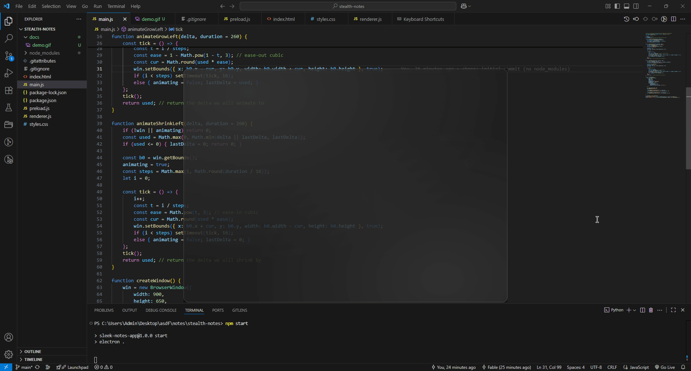

# Stealth Notes

A minimal, glassy **Electron** notes app with a **slide‑out sidebar** that **grows the window to the left** so your text is never covered. Clean, fast, and feels native on Windows 11.

> **Why it’s different:** when the sidebar appears, the app window physically expands left by the same number of pixels. Sidebar + window + content move in **lockstep** for a seamless effect.

---

## ✨ Features

* Frosted‑glass UI (CSS `backdrop-filter`) on a frameless, transparent window
* Blank, type‑anywhere editor (`contenteditable`)
* Hover near the editor’s **left edge** to reveal the sidebar
* Sidebar contains **“＋ New note”** and a notes list (in‑memory model)
* Window **grows left** on open and **shrinks back** on close (exact‑delta animation)
* Smooth, state‑guarded animations (no flicker, no leftover gaps)
* Tiny codebase: plain HTML/CSS/JS + Electron 29

---

## 🖼️ Demo

```md

```

---

## 🚀 Quick start

**Requirements**

* Node.js ≥ 18
* npm (bundled with Node)
* Windows 10/11 (tested on Win 11; macOS/Linux may work with minor tweaks)

**Run**

```bash
git clone https://github.com/FableFallen/stealth-notes.git
cd stealth-notes
npm ci           # or: npm install
npm start
```

> You may see an Electron security/CSP warning in dev. That’s expected for a prototype; add a CSP for production.

---

## 🗂 Project structure

```
stealth-notes/
  ├─ index.html        # layout: sidebar + main content (editor)
  ├─ styles.css        # glass look, transitions, CSS variables
  ├─ main.js           # creates BrowserWindow; left grow/shrink animations
  ├─ preload.js        # safe bridge: win.smoothGrowLeft/ShrinkLeft
  ├─ renderer.js       # UI logic: edge trigger, state machine, notes model
  ├─ package.json      # scripts and electron dependency
  ├─ package-lock.json
  └─ .gitignore        # excludes node_modules, builds, etc.
```

---

## 🔧 How it works (short technical overview)

* **Exact‑delta lockstep:**
  `main.js` animates the window **left** and returns the **actual pixels** used (clamped if near the screen edge).
  `renderer.js` uses that exact value for:

  * `--content-shift` (push editor right)
  * `sidebar.style.width`
  * container‑relative `left = (editor.left − container.left) − usedPx`
  * shrinking back by the same `usedPx` on close

* **Same‑frame start:** Sidebar slide‑in and window grow start together.

* **Container coordinates:** Position the sidebar relative to `.app-container`, not the viewport.

* **State machine:** `closed → opening → open → closing` prevents double‑triggers on fast mouse moves.

* **rAF realignment:** During the animation, the sidebar re‑aligns each frame so it always hugs the editor’s left edge.

---

## ⚙️ Tweakable settings

In **`renderer.js`**:

```js
const REQUEST_W = 280; // sidebar target width (px)
const ANIM_MS   = 260; // animation duration (ms)
const TRIGGER   = 14;  // px zone near editor’s left edge to open
const CLOSE_M   = 40;  // px beyond editor’s left edge to auto-close
```

In **`styles.css`**:

```css
:root {
  --sidebar-w: 280px;     /* not strictly required; JS sets exact width */
  --content-shift: 0px;   /* set by JS to the exact used width */
}
```

---

## 🧭 Usage

* **Open sidebar:** hover within `TRIGGER` px of the editor’s left edge.
* **Close sidebar:** move cursor `CLOSE_M` px to the right of that edge or leave the sidebar.
* **New note:** click “＋ New note”.
* **Move the window:** drag the top translucent bar.

---

## 🧪 Troubleshooting

**No blur / transparency**

* Ensure Electron 29+ and Windows 10/11.
* The window is created with `transparent: true` and the page background is `transparent`.
* Some GPUs disable heavy backdrop filters; try lowering blur/saturate.

**Sidebar shows a blank gap first**

* Use the latest `renderer.js`: animations start the same frame and we compute `left` after one paint so transforms have landed.

**Gap remains after closing**

* Open/close must use the **same delta**. `main.js` returns the actual used pixels and `renderer.js` uses that value for all geometry.

**Git: “file >100MB (electron.exe)”**

* Never commit `node_modules/`. Keep `.gitignore` with `node_modules/` and re‑commit.
  If it slipped into history, remove with `git rm -r --cached node_modules` then commit; or rewrite with `git filter-repo`/BFG.

---

## 🛠 Scripts

```json
{
  "scripts": {
    "start": "electron ."
  }
}
```

> Packaging is not set up yet. If you want installers/builds, add **Electron Forge** or **electron-builder** later.

---

## 🧩 Contributing

1. Fork & clone
2. `npm ci`
3. Create a branch: `git checkout -b feat/my-change`
4. Commit with clear messages
5. Open a PR (include a short before/after clip for UI changes)

**Code style:** plain JS, small functions, guard against NaN, prefer container‑relative geometry.

---

## 📚 Roadmap / ideas

* Persist notes (JSON/SQLite)
* Keyboard shortcut to toggle sidebar
* Titlebar controls (minimize/close) in the drag bar
* macOS acrylic / Windows Mica native background options
* Respect `prefers-reduced-motion`
* Basic tests for geometry math & clamping

---

## 📝 License

MIT (or your choice). Add a `LICENSE` file if you want something different.

---

## 🙏 Acknowledgements

* Electron team and docs
* Everyone who shared tips on backdrop‑filter performance and transparent windows

---

## FAQ

**Why grow the window instead of overlaying the sidebar?**
To avoid covering text and to feel like a native panel that expands the app’s footprint.

**Why container‑relative math?**
The sidebar is absolutely positioned **inside** `.app-container`. Using viewport numbers for `left` can push it off‑screen; we compute `left` as `editor.left − container.left − width`.

**What are the two IPC helpers?**
`win.smoothGrowLeft(px, ms)` and `win.smoothShrinkLeft(px, ms)` ask the main process to animate window bounds and return the **actual** pixels used so renderer math stays in sync.
